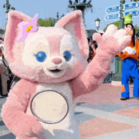

```{r setup, include=FALSE}
knitr::opts_chunk$set(echo = FALSE)
```

```{css}
.navbar{
  background: #66CDAA;
}
h1,h3{
  color: #008B8B;
}
```

# **Welcome**

<br>

### *Hello there! This is Shaine's blog~*

### *The blog is made for the assignment 1 & 2 of ETC5523 Communicating with Data*

<br>

```{r welcomegif, out.extra='style="padding:20px"'}

```
